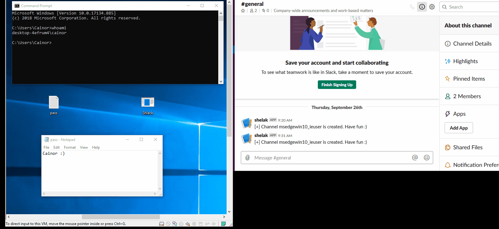

# Shlack
Make your Slack group a C2 server :)
Shlack = Shell + Slack

## Features
1. Traffic is HTTPS encrypted, using Slack's crtificate.
2. Your IP can only be tracked by Slack's team.
3. Supports Windows and Linux OS.
4. Supports multiple targets by creating a new channel for each target.

## How it works
A python script is connected to the Slack group you made using the BotToken and the OauthToken, Doing the following:
1. Create a channel for each victim using the 'hostname' and 'logged-in username' as part of the channel name.
2. Writes logs in "general" channel, about the creatation of the channel.
3. Now, the shell is ready to receive commands sent to the created channel. And only to the created channel.
4. The shell will output the results as a message in the same group.

## Things you need to do
For this to work you must have the following:
1. A Slack group.
2. A Slack app.
3. Add the app to the group.
4. Add the app to the channel created by the victim. (This is important so that the messages sent through the channel is received by the shell)
5. Give the app the following permissions from "OAuth & Permissions" section:
   - channels:history
   - channels:write
   - bot
   - search:read
6. Put the app 'OAuth Access Token' to 'oauth_token' and 'Bot User OAuth Access Token' to 'slack_token' in the code.
7. Turn the py to exe if you think it's necessarily to achive your goals :-)
8. This works on python 3.6 .. Also it needs Slack module which can be downloaded using:
    ```
    pip install slackclient
    ```
    
## Demo

